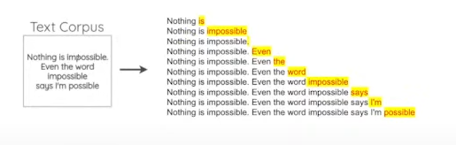
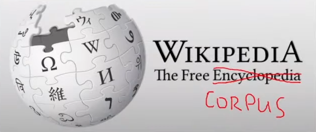

# Transformers e ChatGPT: Entendendo a Revolução da Inteligência Artificial Generativa
Neste repositório, oferecemos uma visão geral abrangente da inteligência artificial generativa, focando na arquitetura de transformers, especificamente o mecanismo de self-attention, e explorando como o ChatGPT se encaixa e avança nesse contexto revolucionário. Aqui, você encontrará recursos detalhados sobre os fundamentos técnicos dos transformers, aplicações práticas e a evolução contínua do ChatGPT como um dos exemplos mais avançados de IA conversacional baseada nessa tecnologia.

Imagem gerada por DALL-E 2

## Visão Geral dos Tópicos Abordados

- **Inteligência Artificial Generativa**
    - **Definição e Fundamentos**: Entenda o que é IA generativa e como ela se diferencia de outras formas de inteligência artificial.
    - **Aplicações**: Explore os diversos usos da IA generativa em diferentes indústrias, como arte, música, e design de jogos.
    - **Desafios e Perspectivas**: Discuta os desafios técnicos e éticos envolvidos no desenvolvimento e implementação de IA generativa.
- **Processamento de Linguagem Natural**
    - **Evolução e linha do tempo**: Um panorama da evolução histórica do PLN, com uma linha do tempo que ilustra os principais avanços tecnológicos e modelos de destaque.
    - **Por que PLN**?
        - **Qual é a tarefa de PLN que não preciso de anotação manual?**: Explicação sobre as tarefas de PLN que podem ser realizadas sem a necessidade de grandes esforços de anotação manual, como a previsão da próxima palavra.
        - **Conjunto de dados auto supervisionado**: Um detalhamento sobre o uso de conjuntos de dados auto supervisionados em PLN, demonstrando como essas técnicas estão mudando a maneira de treinar modelos de linguagem.

- Referências

## Inteligência Artificial Generativa
É fundamental entender que a Inteligência Artificial Generativa não se limita apenas a modelos ultra sofisticados com bilhões de parâmetros. Na verdade, essa área abrange uma variedade de ferramentas de geração de conteúdo que empregam diversas técnicas, particularmente aquelas baseadas em aprendizado profundo (deep learning). Estas ferramentas são projetadas para facilitar a criação automática de dados e informações, oferecendo soluções inovadoras em diversos campos de aplicação.

Fonte: Imagem gerada por DALL-E 2

Diferentemente do que é comumente conhecido como IA discriminativa, analítica ou tradicional, que se refere a ferramentas e algoritmos destinados à análise de dados existentes para identificar padrões ou fazer previsões, como a detecção de spam em caixas de e-mail ou a recomendação de conteúdo, a IA generativa avança além dessas aplicações. Ela emprega sistemas e modelos complexos para criar saídas totalmente novas ou inovadoras. Essas saídas podem ser imagens, textos ou áudios, gerados a partir de prompts de linguagem natural.

### Modelos e aplicações de IA generativa podem, por exemplo, ser usados para:

- **Geração de Texto**: 
A geração de texto por IA evoluiu desde a década de 1970, com inovações recentes como o ChatGPT da OpenAI. Este modelo é capaz de responder perguntas complexas com base em uma extensa base de dados textuais, simulando uma conversa humana realística.

Fonte: https://hypescience.com/

- **Geração de Imagem**:
Modelos como o DALL-E 2 utilizam prompts de texto para criar imagens detalhadas. Por exemplo, ao receber o prompt "pintura a óleo em estilo impressionista de um cachorro Shiba Inu", o modelo pode gerar uma imagem artística correspondente.

Fonte: https://dopcomunicacao.com.br/

- **Geração de Vídeo**:
O modelo Stable Diffusion transforma vídeos existentes aplicando novos estilos visuais baseados em descrições textuais. Um exemplo prático é a geração de um vídeo onde o estilo visual de um filme clássico é aplicado a cenas modernas.

Fonte: Imagem gerada por DALL-E 2

- **Geração de Código de Programação**: 
O GitHub Copilot, alimentado pelo modelo Codex da OpenAI, ajuda desenvolvedores a gerar e completar códigos em diversas linguagens de programação, facilitando a escrita de software ao sugerir trechos de código baseados no contexto do projeto.

Fonte: Imagem gerada por DALL-E 2

- **Geração de Dados**:
A geração de dados sintéticos permite aumentar conjuntos de dados e melhorar a precisão de modelos de Machine Learning, sem comprometer a privacidade. Empresas de carros autônomos, como a Waymo, usam esses dados para treinar seus sistemas em cenários simulados do mundo real.

Fonte: Imagem gerada por DALL-E 2

# Processamento de Linguagem Natural
A imagem abaixo ilustra um pouco da evolução das tecnologis no PLN até os dias atuais.

Fonte: https://blog.dsacademy

## Por que PLN?
Como visto no tópico acima, existem diversas aplicações para redes generativas. No entanto, a aplicação que mais se destaca está relacionada ao Processamento de Linguagem Natural (PLN), especialmente em geração de texto. Isso levanta uma pergunta:

- Por que houve esse boom em geração de texto e não em geração de imagem?

### Qual é a tarefa de PLN que não preciso de anotação manual?

 Descrição: Prever a proxima palavra

### Conjunto de dados auto supervisionado

# Referências

- [Guia Completo sobre Inteligência Artificial Generativa - DS Academy](https://blog.dsacademy.com.br/guia-completo-sobre-inteligencia-artificial-generativa/)
- [LLMs e a Evolução da IA Generativa](https://blog.dsacademy.com.br/llms-e-a-evolucao-da-ia-generativa/)
- [IA377 - Seminários FEEC: Roberto LotufoTítulo do Artigo 3](https://www.youtube.com/live/PuKaN2mqMvg?si=MyYQ8S2ZaNUMqG26)
